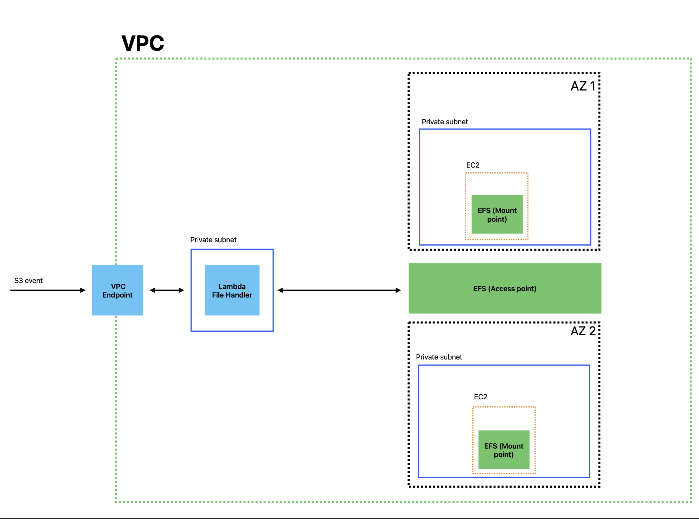

# AWS Persistance layer

Whenever accessing data from AWS S3, one needs to download it to the file system of the instance, make changes, and then replace data in the S3 bucket. This leads to a lot of requests. AWS S3 per-request costs are quite high. Most sites using AWS S3 put some sort of caching in front of it.

Now, lets imagine thousands of instances downloading large media files or datasets to do some processing. It "seems wrong" to download again and again by each of them.

It would be more optimal to dowload the data somewhere (like in a shared file system) once, and let instances access it. AWS Elastic File System provides a file system that ensures concurrent access to thousands of instances and maintains long lived connections, this thanks to a super turbo network known as Hyperplane that EFS utilizes under the hood.


## Architecture


#### Persistance layer




## Steps

#### Shared infrastructure

cd terraform
terraform init
terraform plan
terraform apply

#### App-specific infrastructure

```http
* Run `npm run build <application name>` to build your selected application.
* Run `npm run deploy <application name>` to deploy your selected application.
```

